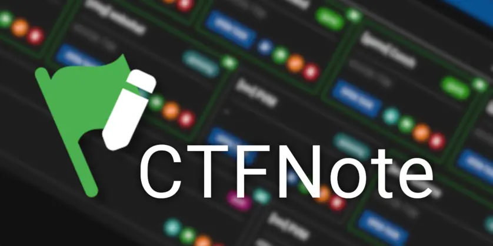
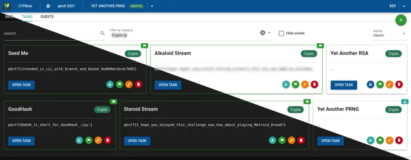
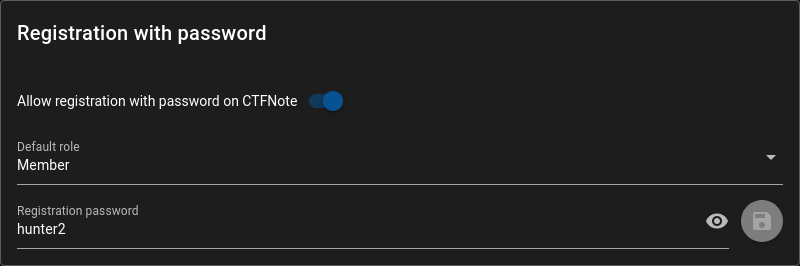
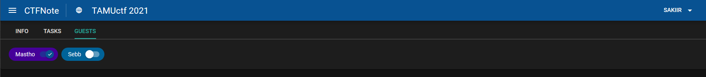
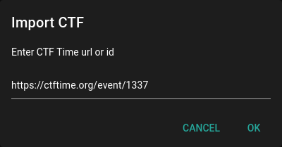
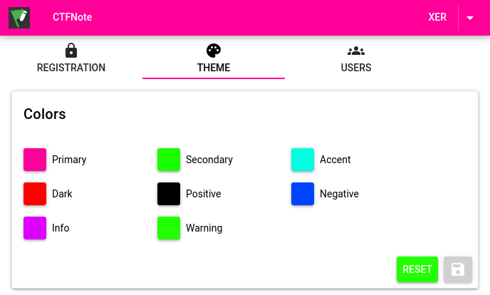
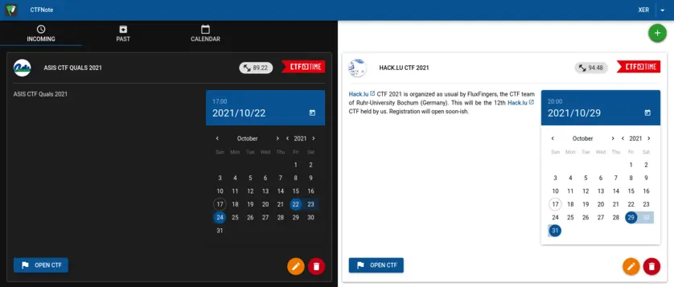
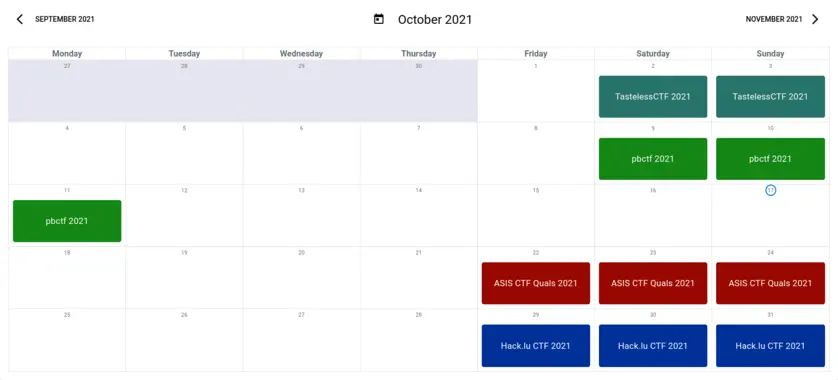
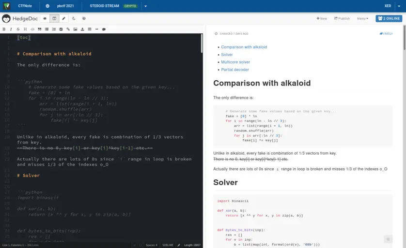

[](screenshots/logo.png)

# CTFNote

## Introduction

CTFNote is a collaborative tool aiming to help CTF teams to organise their work.

[](screenshots/task.png)

## Installation

Before starting, make sure to fill in the information in the `.env` file.

Then you can start it with `docker-compose`. The default
configuration makes it super easy to start a new instance!

```shell
$ docker-compose up -d
```

The instance will spawn a web server on port `127.0.0.1:8080`. The first account created will
have administrative privileges.

Please use nginx to make it available over HTTPS.

### Enable HTTPS with nginx

It is assumed that you want to serve CTFNote over HTTPS.

An example configuration for `nginx` on the host looks like this:

```
server {
        server_name ctfnote.my.domain;

        root /var/www/html;
        index index.html;

        location / {
                proxy_pass http://127.0.0.1:8080/;
                proxy_http_version 1.1;
                proxy_set_header Upgrade $http_upgrade;
                proxy_set_header Connection $http_connection;
                proxy_set_header Host $http_host;
                proxy_set_header X-Real-IP $remote_addr;
                proxy_set_header X-Forwarded-For $proxy_add_x_forwarded_for;
                proxy_set_header X-Forwarded-Proto $scheme;
                add_header Pragma "no-cache";
        }
}
```

Edit the `docker-compose.yml` file to make sure CTFNote only listens on
localhost:

```diff
-      - 8080:80
+      - 127.0.0.1:8080:80
```

Edit the `.env` file to instruct the pad to use TLS:

```diff
 # Secure: we're using HTTPS
-# CMD_PROTOCOL_USESSL=true
+CMD_PROTOCOL_USESSL=true

 # Domain: you need to define this if you wish to enable any options
-# CMD_DOMAIN=example.org:1337
+CMD_DOMAIN=example.org:1337
```

After deploying this configuration, run `certbot` to make it available over HTTPS.
See [this article](https://www.digitalocean.com/community/tutorials/how-to-secure-nginx-with-let-s-encrypt-on-ubuntu-20-04) for more information.

### Migration

If you already have an instance of CTFNote in a previous version and wish to
upgrade, you should follow the guide at [MIGRATION.md](MIGRATION.md).

## Privileges

When other players register on your CTFNote instance, they will not be able to
see CTF or tasks. This is because CTFNote uses different roles to restrict CTF

You can manage other players' roles in the _Users_ tab of the _Admin_ panel.

Additionally, you can generate a secret that lets users create an account with a
different privilege in the _Registration with password_ menu in the _Admin_
panel.



### Guest

Guest is the default role. This role is meant to be used for guests and friends
helping sporadically on CTF.

You can add a guest to a CTF by ticking their badge in the _Guests_ tab on a
specific CTF.



### Friend

Friend is a role between guest and member which allows the player to automatically
view old CTFs but not active and upcoming CTFs. They are also not allowed to invite any
new players to a CTF. You can use this role to grant guests access to your old CTFs
for them to learn from without granting access to each old CTF individually.

### Member

Member is a role that represents a team member. A certain level of trust is
given to these users: they can see every CTF, future, current and past. They can
also invite guests to CTF.

### Manager

Manager is a role that represents a team captain. They can create, import,
modify and delete CTF.

They can import CTF directly from [CTFtime](https://ctftime.org).



### Admin

Admin is a role with every privileges. They have access to the _Admin_ panel
that lets them delete accounts, change permissions, reset passwords, create
one-time secrets and, most importantly, change the theme colours.



## Configuration

The configuration can be changed in the `.env` file. This file contains
environment variables for the containers.

The value of every variables are explained in this file.

## Screenshots

### List of the CTF

[](screenshots/ctf.png)

### Calendar

[](screenshots/calendar.png)

### Information of a single CTF

[](screenshots/info.png)

### Task list for a CTF

[](screenshots/task.png)

### Shared notepad for a task

[](screenshots/pad.png)

## Contributing

A contribution guide is available here: [CONTRIBUTING.md](CONTRIBUTING.md)
