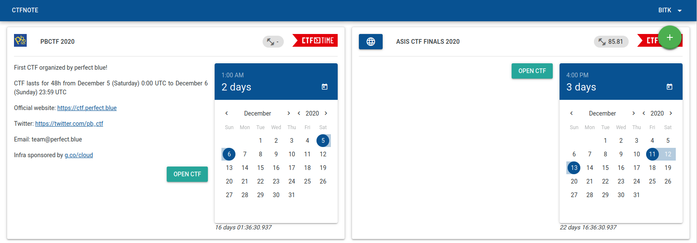
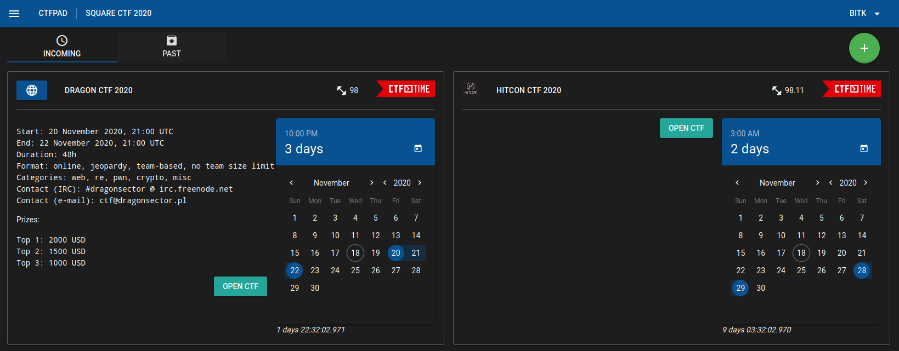
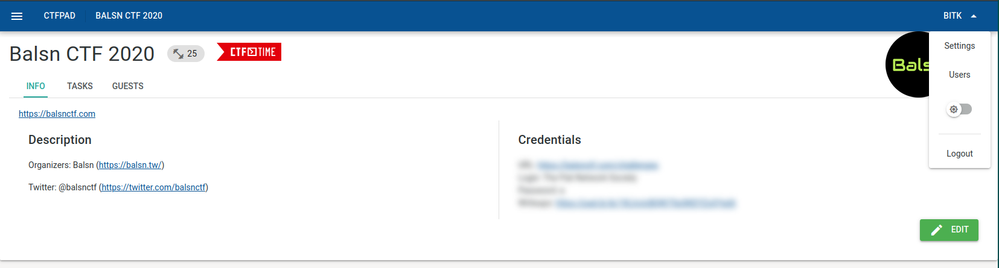
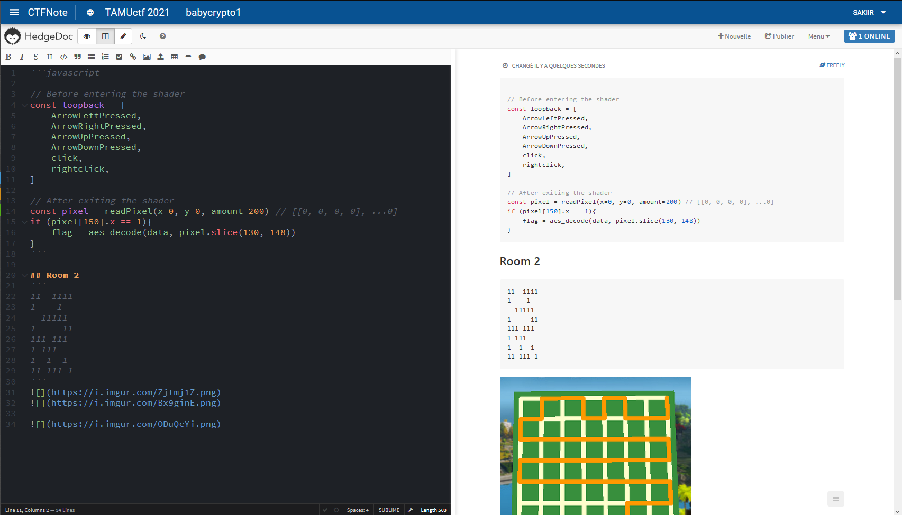

# CTFNote

## Welcome

CTFNote is a collaborative tool aiming to help CTF teams to organise their work.










## Installation

Use the provided docker configuration to deploy the project:

```shell
$ docker-compose up -d
```

Then, visit 127.0.0.1 and create your first account, which will automatically be provided with admin privileges

You can optionally edit the API configuration file depending on your needs:

[API Configuration File](./api/src/config/globals.ts)

## External Authentication

You can set an external authentication like Keycloak or OAuth with CTFNote.

### Usage 

You have to set environment variables throught docker-compose.yml.

As admin, you can allow or block the external authentication and/or registration if the user doesn't exist in the db.

#### Oauth2 :

Routes from frontend:
- https://127.0.0.1/api/auth/oauth/
- https://127.0.0.1/api/auth/oauth/callback

Env vars:
```
EXTERNAL_AUTHENTICATION_MODULES: "oauth2"
EXTERNAL_AUTHENTICATION_OAUTH2_CLIENT_ID: "client_id"
EXTERNAL_AUTHENTICATION_OAUTH2_CLIENT_SECRET: "client_secret"
EXTERNAL_AUTHENTICATION_OAUTH2_AUTHORIZATION_URL: "https://example.com/auth/"
EXTERNAL_AUTHENTICATION_OAUTH2_TOKEN_SERVER_URL: "https://example.com/token/"
```

Notes: Maybe not functional because the user's profile does not seem to be retrieved by Passport. 

#### Keycloak

Routes from frontend:
- https://127.0.0.1/api/auth/keycloak/
- https://127.0.0.1/api/auth/keycloak/callback

Env vars:
```
EXTERNAL_AUTHENTICATION_MODULES: "keycloak"
EXTERNAL_AUTHENTICATION_KEYCLOAK_CLIENT_ID: "client_id"
EXTERNAL_AUTHENTICATION_KEYCLOAK_CLIENT_SECRET: "client_secret"
EXTERNAL_AUTHENTICATION_KEYCLOAK_AUTH_URL: "https://example.com/auth"
EXTERNAL_AUTHENTICATION_KEYCLOAK_REALM: "Realm"
```

### Implement new methods

If you want more methods, you have to implement them with [Passport](http://www.passportjs.org/).
Don't hesitate to PR it :D

1. Add your module name inside the array `externalAuthenticationModuleAuthorized` (`api/src/config/globals.ts`). It's very important as the route will be generated from it. 

```javascript
static externalAuthenticationModuleAuthorized = ['oauth2','keycloak','<your_module>'];
```

2. Add the environment variables that you need. Example for oauth2 :

```javascript
static externalAuthenticationOauthClientID = process.env.EXTERNAL_AUTHENTICATION_OAUTH_CLIENT_ID || "";
static externalAuthenticationOauthClientSecret = process.env.EXTERNAL_AUTHENTICATION_OAUTH_CLIENT_SECRET || "";
static externalAuthenticationOauthAuthorizationUrl = process.env.EXTERNAL_AUTHENTICATION_OAUTH_AUTHORIZATION_URL || "";
static externalAuthenticationOauthTokenServerUrl = process.env.EXTERNAL_AUTHENTICATION_OAUTH_TOKEN_SERVER_URL || "";
```

3. Add your passport method inside `api/src/config/passport.ts`. Example:
```javascript
if (Globals.externalAuthenticationModules.indexOf('keycloak') != -1){
  passport.use('keycloak',new KeyCloakStrategy({
      clientID: Globals.externalAuthenticationKeycloakClientID,
      clientSecret: Globals.externalAuthenticationKeycloakClientSecret,
      authServerURL: Globals.externalAuthenticationKeycloakAuthUrl,
      callbackURL: '/api/auth/keycloak/callback',
      realm: Globals.externalAuthenticationKeycloakRealm,
      publicClient: 'false',
      sslRequired: 'external',
    },
    function(accessToken, refreshToken, profile, done) {
  	  findOrCreateExternalUser(profile,done);
    })
  );
}
```

## Privileges

* ADMIN_ALL: can create CTFs, tasks, edit users/the config. 
* EDIT_CTF: can create and modify CTF information; you should grant this right to
  your captain
* CTF_ALL: can join every CTF; you should grant this right to your team members.
* no privileges: can only view CTFs when invited; this is used for irregular guests.

CTF guests are allowed to create and edit tasks, but not the CTF information. 

## Development

The development server includes a simple HTTP proxy allowing the frontend to access the local API (cf [quasar.conf.js](front/quasar.conf.js)).
Hot reloading is configured on both components as well.

### Setup and launch the frontend

```shell
$ cd front/
$ yarn install
$ yarn start
```

### Setup and launch the API

```shell
$ cd api/
$ yarn install
$ yarn start
$ MD_PROVIDER=https://ur-codimd-instance-full-url yarn start
```

## Authors

[BitK](https://twitter.com/bitk_)
[SakiiR](https://twitter.com/sakiirsecurity/)

