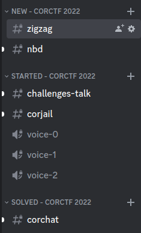

[](screenshots/logo.png)

# CTFNote

## Introduction

CTFNote is a collaborative tool aiming to help CTF teams to organise their work.

[](screenshots/task.png)

## Installation

**Before starting**, make sure to copy `.env.example` to `.env` and fill in the information in the `.env` file.

### Running the Docker containers

You can build and start CTFNote with `docker compose`. The default
configuration makes it super easy to start a new instance!

Building CTFNote requires at least 3 GB of RAM. If you want to host CTFNote
on a server with less than 3 GB of RAM, you can use the pre-build images
from the GitHub Container Registry.

To use the pre-build images, download `docker-compose.yml` (for example through cloning the repository) and run:

```shell
sudo docker compose up -d --pull always
```

### Self-build images

You can build and start CTFNote with `docker compose`. The default
configuration makes it super easy to start a new instance!

```shell
sudo docker compose up -d --build
```

### Accessing the instance

The instance will spawn a web server on port `127.0.0.1:8080`. The first account created will
have administrative privileges.

Please use nginx to make it available over HTTPS.

### Enable HTTPS with nginx

It is assumed that you want to serve CTFNote over HTTPS.

An example configuration for `nginx` on the host looks like this:

```
server {
        server_name ctfnote.my.domain;

        root /var/www/html;
        index index.html;

        location / {
                proxy_pass http://127.0.0.1:8080/;
                proxy_http_version 1.1;
                proxy_set_header Upgrade $http_upgrade;
                proxy_set_header Connection $http_connection;
                proxy_set_header Host $http_host;
                proxy_set_header X-Real-IP $remote_addr;
                proxy_set_header X-Forwarded-For $proxy_add_x_forwarded_for;
                proxy_set_header X-Forwarded-Proto $scheme;
                add_header Pragma "no-cache";
                client_max_body_size 5M;
        }
}
```

Edit the `.env` file to instruct the pad to use TLS:

```diff
 # Secure: we're using HTTPS
-# CMD_PROTOCOL_USESSL=true
+CMD_PROTOCOL_USESSL=true

 # Domain: you need to define this if you wish to enable any options
-# CMD_DOMAIN=example.org:1337
+CMD_DOMAIN=example.org:1337
```

After deploying this configuration, run `certbot` to make it available over HTTPS.
See [this article](https://www.digitalocean.com/community/tutorials/how-to-secure-nginx-with-let-s-encrypt-on-ubuntu-20-04) for more information.

### Add Discord bot support



To add support for the CTFNote discord bot, you need to change the following values in the `.env` file:

```
USE_DISCORD=true
DISCORD_BOT_TOKEN=secret_token
DISCORD_SERVER_ID=server_id
```

You can also configure the amount of voice channels you want per CTF by changing `DISCORD_VOICE_CHANNELS`.

To get the `DISCORD_BOT_TOKEN`, you need to create a discord bot and add it to your server.
You can follow [this guide](https://discordpy.readthedocs.io/en/stable/discord.html) to do so.

- Please grant the bot the following intents: Presence Intent, Server Members Intent, Message Content Intent.
- Please grant the bot the following permissions: Administrator.

When you are done, copy the token from the Build-A-Bot section and paste it in the `.env` file.

You can find the `DISCORD_SERVER_ID` in the 'Widget' section of your server settings.

#### Limitations

Please do not use this bot if untrusted members can create channels or categories in your server, or can edit topics of channels.
This can cause privilege escalations within CTFNote.

Please also note that syncing the CTFNote state to Discord is prone to race conditions.
Therefore, some actions such as importing tasks are now serialized (due to correctly handling the 50 channel limit per category of Discord).
Therefore you should patiently wait before the bot is done importing before you perform certain actions, such as deleting or editing the CTF.
The bot will tell you when its done by editing the private reply.
You will now also see more loading animations within CTFNote to indicate syncing to Discord.

Discord also has modification timeouts when you perform certain actions such as editing the category or channel name.
If you modify a task or CTF name multiple times in a row, the sync to Discord can't be performed and you should rename the CTF categories / task channel and topic manually in order to restore syncing.

#### Available commands

- `/link [token]`: link you Discord account with your CTFNote account through the CTFNote token found in your profile.
- `/create`: create Discord categories, channels and roles for any upcoming / active CTF.
- `/archive`: convert the messages in the channels of a CTF to a task to be stored permanently in CTFNote.
- `/delete`: remove the Discord categories, channels and roles for a CTF.
  You must first create an `/archive` before you can do this.
- `/start`: start working on the task linked to the Discord channel.
- `/stop`: stop working on the task linked to the Discord channel.
- `/solve [flag]`: solve the task linked to the Discord channel.
  Solving can only be done once and flags cannot be removed/overridden through Discord.

The `/create`, `/archive` and `/delete` commands are only accessible when you have Discord administrator rights (not related to the CTFNote administrator rights).
`/start`, `/stop` and `/solve` are only accessible to users who have `/link`ed their Discord account.

The bot will automatically create more categories when you hit the 50 Discord channel limit, so you can have an almost infinite amount of tasks per CTF.
It is your own responsibility to stay below the Discord server channel limit, which is 500 at the moment of writing (categories count as channels).

### Migration

If you already have an instance of CTFNote in a previous version and wish to
upgrade, you should follow the guide at [MIGRATION.md](MIGRATION.md).

## Privileges

When other players register on your CTFNote instance, they will not be able to
see CTF or tasks. This is because CTFNote uses different roles to restrict CTF

You can manage other players' roles in the _Users_ tab of the _Admin_ panel.

Additionally, you can generate a secret that lets users create an account with a
different privilege in the _Registration with password_ menu in the _Admin_
panel.


### Guest

Guest is the default role. This role is meant to be used for guests and friends
helping sporadically on CTF.

You can add a guest to a CTF by ticking their badge in the _Guests_ tab on a
specific CTF.


### Friend

Friend is a role between guest and member which allows the player to automatically
view old CTFs but not active and upcoming CTFs. They are also not allowed to invite any
new players to a CTF. You can use this role to grant guests access to your old CTFs
for them to learn from without granting access to each old CTF individually.

### Member

Member is a role that represents a team member. A certain level of trust is
given to these users: they can see every CTF, future, current and past. They can
also invite guests to CTF.

### Manager

Manager is a role that represents a team captain. They can create, import,
modify and delete CTF.

They can import CTF directly from [CTFtime](https://ctftime.org).


### Admin

Admin is a role with every privileges. They have access to the _Admin_ panel
that lets them delete accounts, change permissions, reset passwords, create
one-time secrets and, most importantly, change the theme colours.


## Configuration

The configuration can be changed in the `.env` file. This file contains
environment variables for the containers.

The value of every variables are explained in this file.

## Screenshots

### List of the CTF

[](screenshots/ctf.png)

### Calendar

[](screenshots/calendar.png)

### Information of a single CTF

[](screenshots/info.png)

### Task list for a CTF

[](screenshots/task.png)

### Shared notepad for a task

[](screenshots/pad.png)

## Contributing

We have a [Discord server](https://discord.gg/uzTybeYuBg) where we discuss the development and feature of CTFNote.

A contribution guide is available here: [CONTRIBUTING.md](CONTRIBUTING.md)
